# MITRE ATT&CK Mapping — Lab 1

## Overview

This document maps all detections from **Lab 1 attack simulations** to the **MITRE ATT&CK Framework**.

| Attack | Tool Used | Wazuh Rule ID | Event ID | MITRE Technique | Tactic | Severity |
|--------|-----------|---------------|----------|-----------------|--------|----------|
| Brute Force via RDP | Hydra (Kali) | 100001 | 4625 | T1110 – Brute Force | Credential Access | Level 12 |
| Credential Dumping Tool Drop | PowerShell (Windows) | 100002 | 11 (Sysmon) | T1003.001 – OS Credential Dumping: LSASS Memory | Credential Access | Level 15 |
| Suspicious PowerShell Execution | PowerShell (Windows) | 100003 | 1 (Sysmon) | T1059.001 – Command and Scripting Interpreter: PowerShell | Execution | Level 12 |

---

## Lab Environment

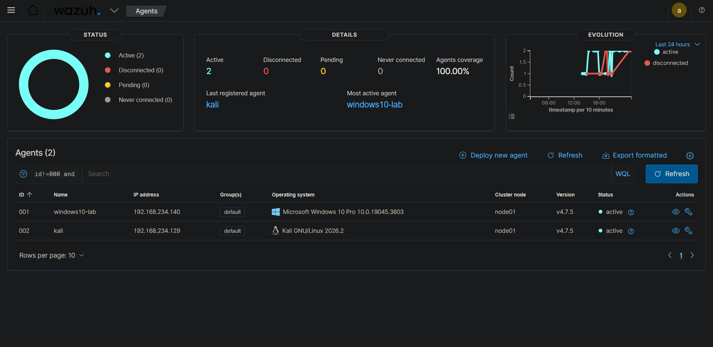

*Both agents (`windows10-lab` and `kali`) are successfully connected and reporting to the Wazuh Manager (`soc-core`).*

---

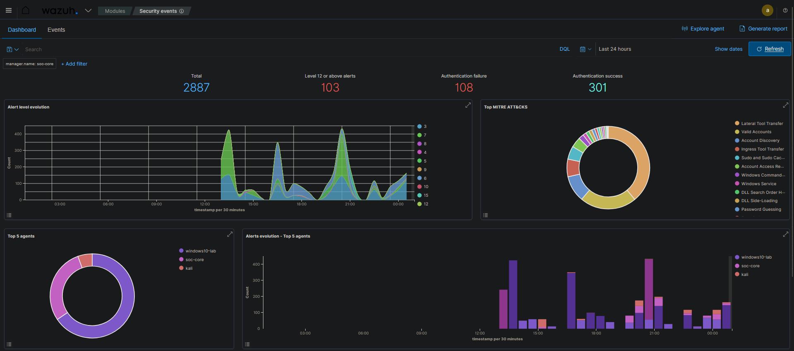

*Wazuh Security Events dashboard showing **2,887 total events**, **103 high-severity alerts**, and **108 authentication failures** over the last 24 hours. The dashboard also displays the MITRE ATT&CK techniques triggered during the attack simulations.*

---

## All Custom Rules Firing

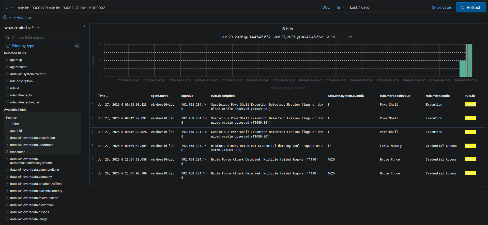

*All three custom detection rules (`100001`, `100002`, and `100003`) successfully triggered in Wazuh Discover, displaying rule descriptions, MITRE ATT&CK mappings, tactics, and associated Windows Event IDs.*

---

# Detailed Detection Breakdown

## T1110 — Brute Force

**Tool:** Hydra

**Source:** Kali Linux (`192.168.234.129`)

**Target:** Windows 10 (`192.168.234.140`) via RDP (Port 3389)

### Detection Logic

- Multiple Windows Security Event **4625** (Failed Logon)
- Five or more failed logon attempts
- Same source IP
- Within 120 seconds

**Wazuh Rule:** `100001`

**Mapped Tactic:** Credential Access

**MITRE Technique:** T1110 — Brute Force

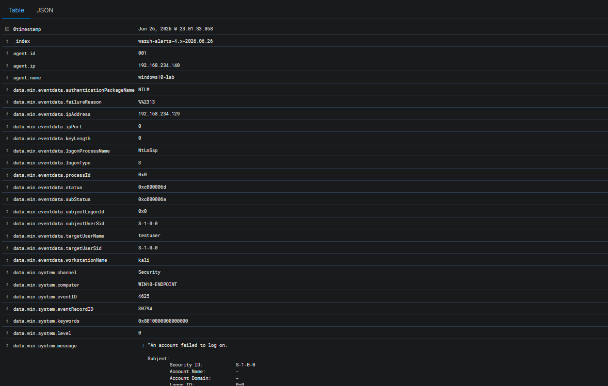
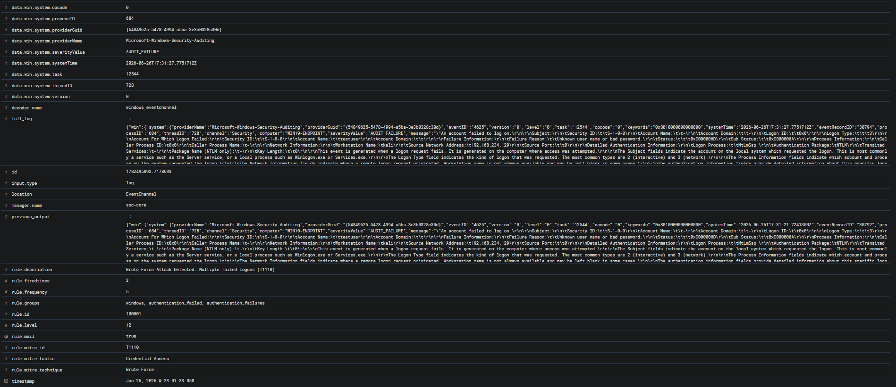

*Custom Rule **100001** detecting multiple failed RDP authentication attempts generated by Hydra from the Kali attacker machine.*

---

## T1003.001 — OS Credential Dumping: LSASS Memory

**Tool:** Mimikatz

**Source:** Windows 10 (Local Execution)

### Detection Logic

- Sysmon Event ID **11**
- File creation monitoring
- Detects filenames containing **mimikatz**
- Triggered during payload drop before credential dumping occurs

**Wazuh Rule:** `100002`

**Mapped Tactic:** Credential Access

**MITRE Technique:** T1003.001 — OS Credential Dumping: LSASS Memory

> **Note:** Although the rule detects the file creation stage rather than actual LSASS memory access, it maps to **T1003.001** because the observed payload is specifically designed for credential dumping.

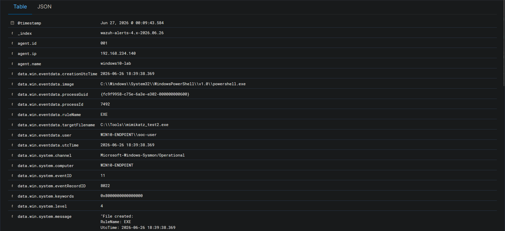
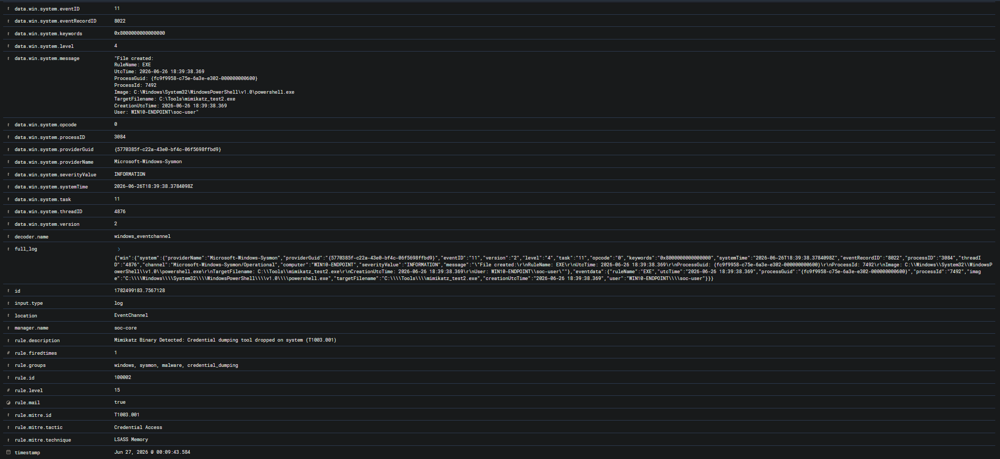

*Custom Rule **100002** detecting Mimikatz executable and supporting DLLs created by PowerShell using Sysmon Event ID 11.*

---

## T1059.001 — Command and Scripting Interpreter: PowerShell

**Tool:** Windows PowerShell

**Source:** Windows 10 (Local Execution)

### Detection Logic

Sysmon Event ID **1** detects PowerShell process creation containing suspicious arguments such as:

- `-enc`
- `-nop`
- `-ExecutionPolicy Bypass`
- `-WindowStyle Hidden`
- `IEX`
- `DownloadString`

**Wazuh Rule:** `100003`

**Mapped Tactic:** Execution

**MITRE Technique:** T1059.001 — Command and Scripting Interpreter: PowerShell

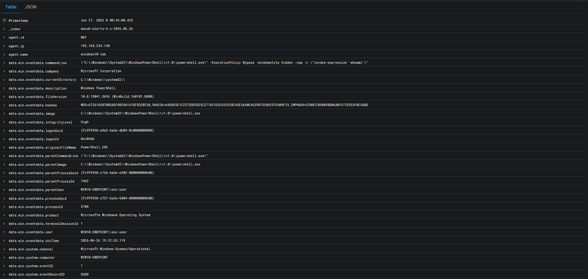
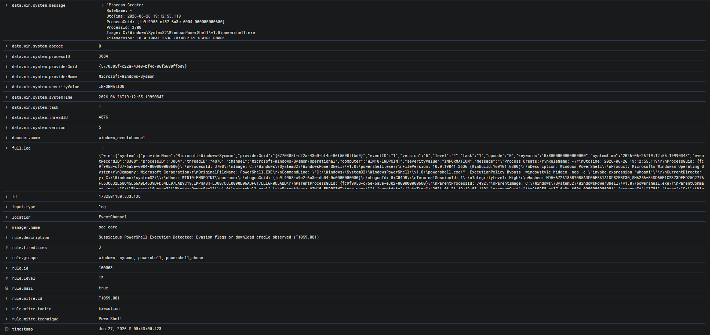
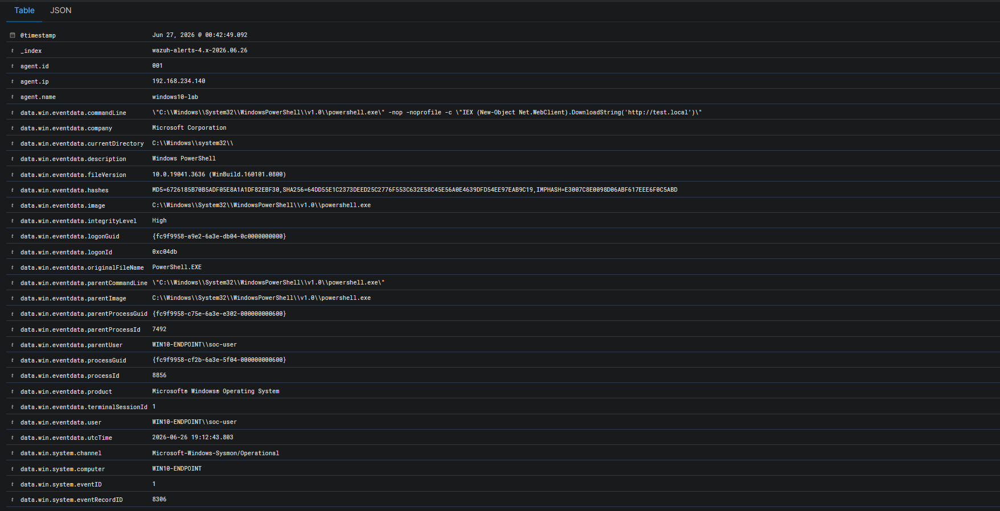
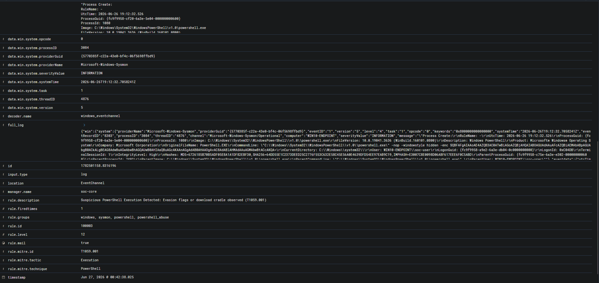
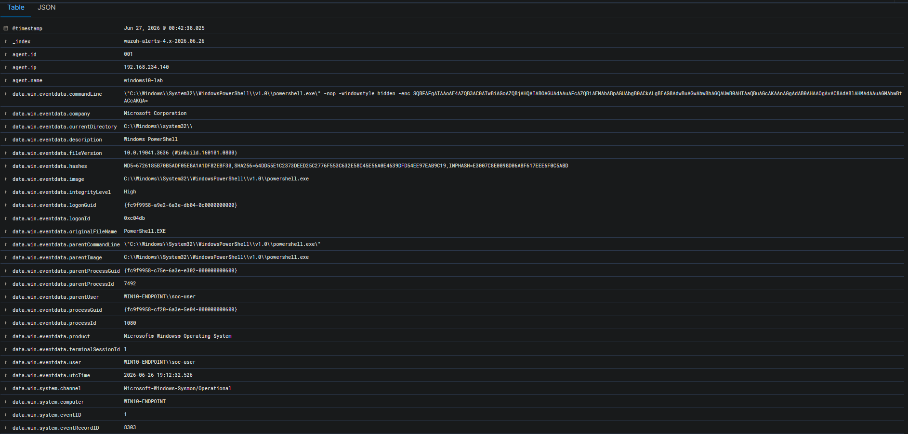
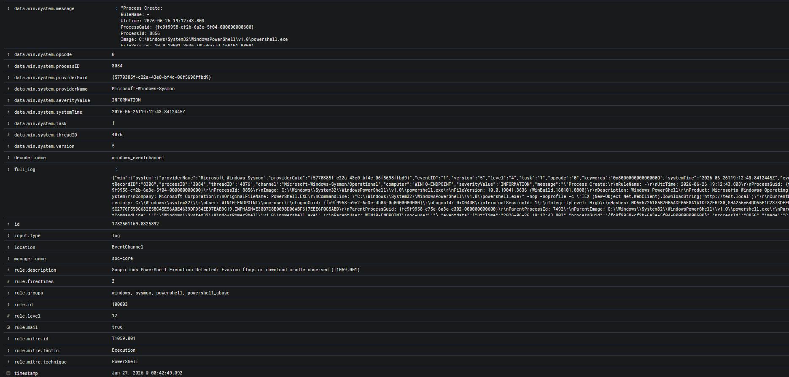


*Custom Rule **100003** detecting suspicious PowerShell execution with encoded commands, execution policy bypass, hidden windows, and download cradle techniques.*

---

# MITRE ATT&CK Coverage Summary

| Technique | Name | Detection |
|-----------|------|-----------|
| T1059.001 | PowerShell | ✅ |
| T1110 | Brute Force | ✅ |
| T1003.001 | LSASS Credential Dumping | ✅ |

---

# Attack Kill Chain

```text
Reconnaissance
      │
      ▼
Initial Access
      │
      ▼
Execution
(T1059.001 – PowerShell)
      │
      ▼
Credential Access
├── T1110 – Brute Force
└── T1003.001 – Credential Dumping
      │
      ▼
Lateral Movement
(Future Lab)

```
---

## References
- [MITRE ATT&CK T1110](https://attack.mitre.org/techniques/T1110/)
- [MITRE ATT&CK T1003.001](https://attack.mitre.org/techniques/T1003/001/)
- [MITRE ATT&CK T1059.001](https://attack.mitre.org/techniques/T1059/001/)


