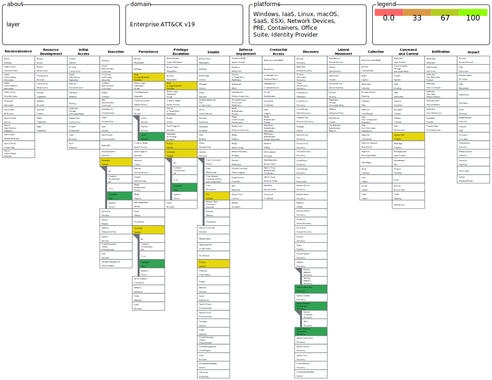

# Lab 2 — Atomic Red Team + ATT&CK Coverage

## Objective
Systematically test Wazuh's detection coverage across 10 MITRE ATT&CK techniques using Atomic Red Team. Identify OOB detection gaps, build a coverage heatmap, and author custom rules to achieve 100% coverage across Credential Access, Persistence, Discovery, Defense Evasion, and Command & Control tactics.

---

## Environment

| VM | Role | OS | IP |
|----|------|----|----|
| soc-core | Wazuh Manager + Dashboard | Ubuntu Server 22.04 | 192.168.234.138 |
| windows10-lab | Victim + Wazuh Agent | Windows 10 Pro | 192.168.234.140 |
| kali | Attacker (standby) | Kali GNU/Linux 2026.2 | 192.168.234.129 |

---

## Lab Phases

| Phase | Description | Status |
|-------|-------------|--------|
| 1 — Setup | Atomic Red Team installation on Windows10-lab | ✅ Complete |
| 2 — Technique Selection | 10 ATT&CK techniques selected across 5 tactics | ✅ Complete |
| 3 — Atomic Execution | All 10 techniques executed, Wazuh results documented | ✅ Complete |
| 4 — Coverage Analysis | ATT&CK Navigator heatmap built, gaps identified | ✅ Complete |
| 5 — Custom Rules | 6 custom rules written and confirmed firing | ✅ Complete |
| 6 — Documentation | Full GitHub documentation | ✅ Complete |

---

## Phase 1 — Setup

Installed Invoke-AtomicRedTeam PowerShell module on Windows10-lab with the full Atomics folder (~500MB, 900+ techniques). Verified installation by running a dry-run ShowDetails check before executing any live tests.

**Setup guide:** [Atomic Red Team Setup](./setup/atomic-redteam-setup.md)

---

## Phase 2 — Technique Selection

10 techniques selected to cover 5 ATT&CK tactics — broad coverage across the attack lifecycle.

| ATT&CK ID | Technique | Tactic |
|-----------|-----------|--------|
| T1082 | System Information Discovery | Discovery |
| T1016 | Network Configuration Discovery | Discovery |
| T1049 | System Network Connections Discovery | Discovery |
| T1053.005 | Scheduled Task Creation | Persistence |
| T1136.001 | Local Account Creation | Persistence |
| T1547.001 | Registry Run Keys | Persistence |
| T1055 | Process Injection | Defense Evasion |
| T1070.004 | File Deletion | Defense Evasion |
| T1003.001 | LSASS Memory Dump | Credential Access |
| T1105 | Ingress Tool Transfer | Command & Control |

---

## Phase 3 — Atomic Execution

Each technique executed via Invoke-AtomicRedTeam. Results checked in Wazuh Discover after each run.

### T1082 — System Information Discovery
- **Command:** `systeminfo`
- **Wazuh Result:** ✅ Detected OOB — Rule 92032
- **Tactic Tagged:** Discovery, Execution

### T1016 — Network Configuration Discovery
- **Command:** `net1 config`
- **Wazuh Result:** ✅ Detected OOB — Rule 92031
- **Tactic Tagged:** Discovery

### T1049 — System Network Connections Discovery
- **Command:** `net1 sessions`
- **Wazuh Result:** ✅ Detected OOB — Rule 92031
- **Tactic Tagged:** Discovery

### T1547.001 — Registry Run Keys
- **Command:** `REG ADD "HKCU\SOFTWARE\Microsoft\Windows\CurrentVersion\Run" /V "Atomic Red Team"`
- **Wazuh Result:** ✅ Detected OOB — Rule 92041
- **Tactic Tagged:** Defense Evasion, Modify Registry

### T1053.005 — Scheduled Task Creation
- **Command:** `schtasks /create /tn "T1053_005_OnStartup" /sc onstart /ru system /tr "cmd.exe /c calc.exe"`
- **Wazuh Result:** ⚠️ Partial — Rule 92032 (generic Execution, wrong tactic)
- **Gap:** No dedicated Persistence/Scheduled Task rule OOB

### T1136.001 — Local Account Creation
- **Command:** `net user /add "T1136.001_CMD" "T1136.001_CMD!"`
- **Wazuh Result:** ❌ Missed — No alert fired
- **Gap:** Wazuh not ingesting Security Event ID 4720 by default, no auditpol configured

### T1055 — Process Injection
- **Command:** `powershell.exe & {C:\AtomicRedTeam\atomics\T1055\bin\x64\CreateThreadNative.exe -debug}`
- **Wazuh Result:** ⚠️ Partial — Rule 92027 (generic PowerShell, wrong tactic)
- **Gap:** No dedicated Process Injection rule OOB

### T1070.004 — File Deletion
- **Command:** `cmd.exe /c del /f %temp%\deleteme_T1551.004`
- **Wazuh Result:** ⚠️ Partial — Rule 92052 (generic Execution, wrong tactic)
- **Gap:** No dedicated Indicator Removal rule OOB

### T1003.001 — LSASS Memory Dump
- **Command:** `rundll32.exe C:\windows\System32\comsvcs.dll, MiniDump (Get-Process lsass).id $env:TEMP\lsass-comsvcs.dmp full`
- **Wazuh Result:** ⚠️ Partial — Rule 92027 (generic PowerShell, wrong tactic)
- **Gap:** No dedicated LSASS dump rule OOB

### T1105 — Ingress Tool Transfer
- **Command:** `(New-Object System.Net.WebClient).DownloadFile("https://raw.githubusercontent.com/redcanaryco/atomic-red-team/master/LICENSE.txt")`
- **Wazuh Result:** ⚠️ Partial — Rule 92027 (generic PowerShell, wrong tactic)
- **Gap:** No dedicated download cradle rule OOB

→ **[All screenshots](./findings/atomic-test-results/)**

---

## Phase 4 — Coverage Analysis

### Coverage Matrix

| ATT&CK ID | Technique | Tactic | Wazuh OOB | OOB Rule | Custom Rule | Final Status |
|-----------|-----------|--------|-----------|----------|-------------|--------------|
| T1082 | System Information Discovery | Discovery | ✅ | 92032 | — | Detected |
| T1016 | Network Configuration Discovery | Discovery | ✅ | 92031 | — | Detected |
| T1049 | System Network Connections Discovery | Discovery | ✅ | 92031 | — | Detected |
| T1547.001 | Registry Run Keys | Persistence | ✅ | 92041 | — | Detected |
| T1053.005 | Scheduled Task Creation | Persistence | ⚠️ | 92032 | 100020 | Fixed |
| T1136.001 | Local Account Creation | Persistence | ❌ | — | 100025 + auditpol | Fixed |
| T1055 | Process Injection | Defense Evasion | ⚠️ | 92027 | 100021 | Fixed |
| T1070.004 | File Deletion | Defense Evasion | ⚠️ | 92052 | 100022 | Fixed |
| T1003.001 | LSASS Memory Dump | Credential Access | ⚠️ | 92027 | 100023 | Fixed |
| T1105 | Ingress Tool Transfer | Command & Control | ⚠️ | 92027 | 100024 | Fixed |

**Result: 4 detected OOB → 6 gaps identified → 10/10 after custom rules**




*ATT&CK Navigator heatmap — green: detected OOB, yellow: custom rule required, red: missed*

→ **[Full coverage matrix](./coverage/coverage-matrix.md)**

---

## Phase 5 — Custom Detection Rules

6 custom rules written in `/var/ossec/etc/rules/local_rules.xml` — all confirmed firing.

### Rule 100020 — Scheduled Task Creation
```xml
<rule id="100020" level="12">
  <if_group>sysmon_event1</if_group>
  <field name="win.eventdata.commandLine" type="pcre2">(?i)schtasks.*\/create</field>
  <description>Scheduled Task Created via CLI - Possible Persistence (T1053.005)</description>
  <mitre>
    <id>T1053.005</id>
  </mitre>
</rule>
```

### Rule 100021 — Process Injection
```xml
<rule id="100021" level="13">
  <if_group>sysmon_event1</if_group>
  <field name="win.eventdata.commandLine" type="pcre2">(?i)(mavinject|CreateThreadNative|CreateRemoteThread)</field>
  <description>Possible Process Injection Detected (T1055)</description>
  <mitre>
    <id>T1055</id>
  </mitre>
</rule>
```

### Rule 100022 — File Deletion
```xml
<rule id="100022" level="10">
  <if_group>sysmon_event1</if_group>
  <field name="win.eventdata.commandLine" type="pcre2">(?i)(cmd.*\/c.*del\s|Remove-Item.*-Force)</field>
  <description>Indicator Removal - File Deletion Detected (T1070.004)</description>
  <mitre>
    <id>T1070.004</id>
  </mitre>
</rule>
```

### Rule 100023 — LSASS Memory Dump
```xml
<rule id="100023" level="15">
  <if_group>sysmon_event1</if_group>
  <field name="win.eventdata.commandLine" type="pcre2">(?i)comsvcs.*MiniDump|rundll32.*comsvcs</field>
  <description>LSASS Memory Dump via comsvcs.dll Detected (T1003.001)</description>
  <mitre>
    <id>T1003.001</id>
  </mitre>
</rule>
```

### Rule 100024 — Ingress Tool Transfer
```xml
<rule id="100024" level="12">
  <if_group>sysmon_event1</if_group>
  <field name="win.eventdata.commandLine" type="pcre2">(?i)(Net\.WebClient|DownloadFile|DownloadString|IWR|Invoke-WebRequest)</field>
  <description>Possible Ingress Tool Transfer via PowerShell Download Cradle (T1105)</description>
  <mitre>
    <id>T1105</id>
  </mitre>
</rule>
```

### Rule 100025 — Local Account Creation
```xml
<rule id="100025" level="12">
  <if_group>sysmon_event1</if_group>
  <field name="win.eventdata.commandLine" type="pcre2">(?i)net.*user.*\/add|net.*localgroup.*administrators</field>
  <description>Local Account Created via net user - Possible Persistence (T1136.001)</description>
  <mitre>
    <id>T1136.001</id>
  </mitre>
</rule>
```

→ **[Full rules file](./detections/local_rules_lab2.xml)**

---

## Key Findings

- Wazuh OOB rules cover Discovery techniques well — `net.exe` and `systeminfo.exe` reliably detected via Sysmon Event ID 1
- Persistence techniques require custom rules — `schtasks /create` only triggers a generic Execution rule OOB, not a Persistence-tagged alert
- T1136.001 (Local Account Creation) was a complete blind spot — required both a custom Sysmon rule and Windows audit policy fix (`auditpol`) to surface Event ID 4720
- Defense Evasion and Credential Access techniques only trigger generic PowerShell rules OOB — specific command line pattern matching is needed
- T1003.001 via `comsvcs.dll MiniDump` is a LOLBin technique — no external tools, harder to block, but detectable via commandLine regex
- All 6 custom rules use PCRE2 regex on `win.eventdata.commandLine` — same detection pattern, scalable to additional techniques

---

## Playbooks

| Playbook | Trigger | MITRE |
|----------|---------|-------|
| [Persistence Response](./playbooks/persistence-response.md) | Rules 100020, 100025, 92041 | T1053.005, T1136.001, T1547.001 |
| [Discovery Response](./playbooks/discovery-response.md) | Rules 92031, 92032 | T1082, T1016, T1049 |

---

## References
- [Atomic Red Team](https://github.com/redcanaryco/atomic-red-team)
- [Invoke-AtomicRedTeam](https://github.com/redcanaryco/invoke-atomicredteam)
- [MITRE ATT&CK Enterprise](https://attack.mitre.org/)
- [ATT&CK Navigator](https://mitre-attack.github.io/attack-navigator/)
- [Wazuh Documentation](https://documentation.wazuh.com)
- [MITRE T1003.001](https://attack.mitre.org/techniques/T1003/001/)
- [MITRE T1053.005](https://attack.mitre.org/techniques/T1053/005/)
- [MITRE T1136.001](https://attack.mitre.org/techniques/T1136/001/)